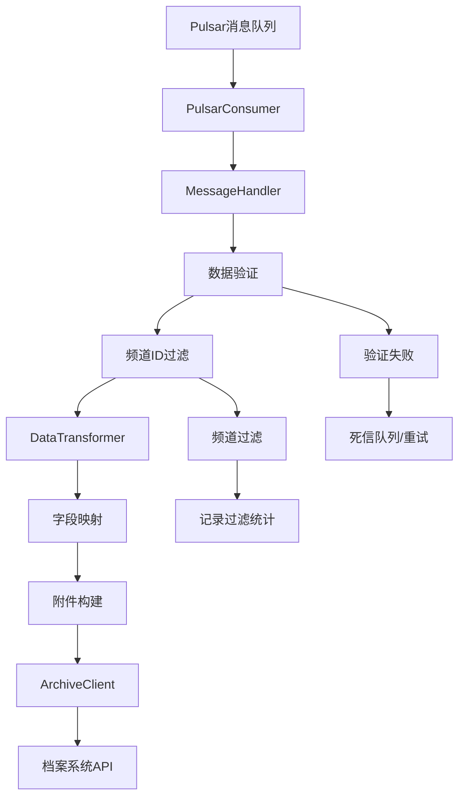

# HyDocPusher 业务逻辑和配置分析

## 任务1：启动日志错误分析

### 错误类型判断
根据分析日志错误和代码结构，**这些错误属于数据格式不匹配错误，而非业务逻辑错误**。

### 具体错误分析

#### 1. Pydantic验证错误详情
```
DATA.DATA.DEFAULTRELDOCS
   Input should be a valid list [type=list_type, input_value='{"DATA":[],"COUNT":0}', input_type=str]
```

**原因分析：**
- 在 `message_models.py:128` 中，`DEFAULTRELDOCS` 字段定义为 `List[Any]`
- 但实际接收到的数据是字符串格式：`'{"DATA":[],"COUNT":0}'`
- Pydantic期望列表类型，却收到了JSON字符串

#### 2. 缺失字段错误
```
DATA.DATA.LISTTITLE - Field required
DATA.CHNLDOC.DOCOUTUPID - Field required  
DATA.CHNLDOC.ACTIONUSER - Field required
```

**原因分析：**
- 这些字段在数据模型中标记为必需字段（`Field(...)`）
- 但实际的消息数据中缺少这些字段
- 说明消息发送方的数据结构与我们的验证模型不完全匹配

### 解决方案建议

#### 1. 数据预处理
在消息验证前添加数据预处理步骤，处理字符串格式的JSON字段：

```python
def preprocess_message_data(message_data: Dict[str, Any]) -> Dict[str, Any]:
    """预处理消息数据，转换字符串JSON为对象"""
    if 'DATA' in message_data and 'DATA' in message_data['DATA']:
        data_section = message_data['DATA']['DATA']
        
        # 处理 DEFAULTRELDOCS 字段
        if 'DEFAULTRELDOCS' in data_section and isinstance(data_section['DEFAULTRELDOCS'], str):
            try:
                parsed = json.loads(data_section['DEFAULTRELDOCS'])
                data_section['DEFAULTRELDOCS'] = parsed.get('DATA', [])
            except json.JSONDecodeError:
                data_section['DEFAULTRELDOCS'] = []
    
    return message_data
```

#### 2. 字段定义调整
将某些必需字段改为可选字段，添加默认值：

```python
# 在 message_models.py 中调整
LISTTITLE: Optional[str] = Field(default="", alias="LISTTITLE")
DOCOUTUPID: Optional[str] = Field(default="", alias="DOCOUTUPID") 
ACTIONUSER: Optional[str] = Field(default="", alias="ACTIONUSER")
```

---

## 任务2：业务逻辑和配置项分析

## 整体业务逻辑

### 1. 系统架构概述
HyDocPusher 是一个文档归档推送系统，主要功能是：
- 从 Pulsar 消息队列接收文档消息
- 验证和转换消息数据
- 推送到档案系统进行归档

### 2. 核心业务流程



### 3. 详细处理流程

#### 3.1 消息接收阶段 (PulsarConsumer)
- **位置**: `hydocpusher/consumer/pulsar_consumer.py`
- **功能**: 
  - 连接到Pulsar集群
  - 订阅指定Topic
  - 接收并解析JSON消息
  - 异常处理和重试机制

#### 3.2 消息验证和过滤阶段 (MessageHandler)
- **位置**: `hydocpusher/consumer/message_handler.py`
- **功能**:
  - 使用Pydantic模型验证消息格式
  - 检查必需字段
  - 验证数据类型和格式
  - **频道ID过滤**: 只处理配置文件中定义的频道消息
  - **过滤策略**: 不在允许列表中的频道消息直接跳过，不进行后续处理

#### 3.3 数据转换阶段 (DataTransformer)
- **位置**: `hydocpusher/transformer/data_transformer.py`
- **功能**:
  - 协调整个转换流程
  - 调用字段映射器和附件构建器
  - 创建档案请求对象

#### 3.4 字段映射阶段 (FieldMapper)
- **位置**: `hydocpusher/transformer/field_mapper.py`
- **功能**:
  - 将源消息字段映射到档案系统字段
  - 数据类型转换和格式标准化
  - 分类信息映射

#### 3.5 附件处理阶段 (AttachmentBuilder)
- **位置**: `hydocpusher/transformer/attachment_builder.py`
- **功能**:
  - 构建HTML正文附件
  - 处理其他类型附件
  - 过滤和限制附件数量

#### 3.6 档案推送阶段 (ArchiveClient)
- **位置**: `hydocpusher/client/archive_client.py`
- **功能**:
  - 发送HTTP请求到档案系统
  - 重试机制和错误处理
  - 响应结果处理

## 配置项详细说明

### 1. Pulsar配置 (PulsarConfig)
```yaml
# 环境变量前缀: PULSAR_
cluster_url: "pulsar://tlqcn-broker:6650"  # Pulsar集群地址
topic: "document.all"                       # 消息主题
subscription: "hydocpusher-subscription"    # 订阅名称
dead_letter_topic: "user-to-pretreat-dlq"  # 死信队列主题
tenant: "public"                            # 租户
namespace: "default"                        # 命名空间
connection_timeout: 30000                   # 连接超时(ms)
operation_timeout: 30000                    # 操作超时(ms)
```

### 2. 档案系统配置 (ArchiveConfig)
```yaml
# 环境变量前缀: ARCHIVE_
api_url: "http://10.20.162.1:8080/news/archive/receive"  # 档案API地址
timeout: 30000                              # 请求超时(ms)
retry_max_attempts: 3                       # 最大重试次数
retry_delay: 60000                          # 重试间隔(ms)
app_id: "NEWS"                              # 应用ID(固定值)
app_token: "TmV3cytJbnRlcmZhY2U="           # 应用Token(固定值)
company_name: "云南省能源投资集团有限公司"      # 公司名称(固定值)
archive_type: "17"                          # 档案类型(固定值)
domain: "www.cnyeig.com"                    # 域名(固定值)
retention_period: 30                        # 默认保留期限
```

### 3. 分类映射配置 (ClassificationConfig)
**配置文件**: `config/classification-rules.yaml`
```yaml
classification_rules:
  - channel_id: "2240"     # 频道ID
    classfyname: "新闻头条"  # 分类名称
    classfy: "XWTT"        # 分类代码
  - channel_id: "2241"
    classfyname: "集团新闻"
    classfy: "JTXW"
  - channel_id: "2242"
    classfyname: "媒体报道"
    classfy: "MTBD"
  - channel_id: "2243"
    classfyname: "红色云能"
    classfy: "HHYN"
  - channel_id: "2244"
    classfyname: "清廉能投"
    classfy: "QLNT"
  - channel_id: "2245"
    classfyname: "公告公示"
    classfy: "GGGS"
  - channel_id: "2246"
    classfyname: "公众号"
    classfy: "GGH"

default:                   # 默认分类
  classfyname: "集团新闻"
  classfy: "JTXW"
```

**重要说明**: 系统现在只处理配置文件中明确定义的频道ID消息，其他频道的消息将被直接过滤跳过。

### 4. 应用主配置 (AppConfig)
```yaml
# 服务器配置
server_host: "0.0.0.0"
server_port: 8080

# 应用配置
app_name: "HyDocPusher"
app_version: "1.0.0"
debug: false

# 性能配置
max_concurrent_messages: 100        # 最大并发消息数
message_processing_timeout: 300000  # 消息处理超时(ms)
batch_size: 100                     # 批处理大小
```

### 5. 日志配置 (LoggingConfig)
```yaml
level: "INFO"                                                    # 日志级别
format: "%(asctime)s [%(levelname)s] %(name)s: %(message)s"    # 日志格式
file_path: "logs/hydocpusher.log"                               # 日志文件路径
max_file_size: "10MB"                                           # 最大文件大小
backup_count: 5                                                 # 备份文件数量
```

## 数据模型说明

### 1. 源消息模型 (SourceMessageSchema)
**主要字段**:
- `MSG`: 消息内容
- `DATA`: 消息数据对象
- `ISSUCCESS`: 成功标志

### 2. 文档数据模型 (DocumentData)
**关键字段**:
- `DOCTITLE`: 文档标题 (必需)
- `RECID`: 记录ID (必需)
- `CHANNELID`: 频道ID (必需)
- `DOCPUBURL`: 发布URL (必需)
- `CRTIME`: 创建时间 (必需)
- `DEFAULTRELDOCS`: 相关文档列表
- `LISTTITLE`: 列表标题

### 3. 频道文档模型 (ChannelDoc)
**关键字段**:
- `DOCOUTUPID`: 文档输出ID (必需)
- `ACTIONUSER`: 操作用户 (必需)
- `DOCFIRSTPUBTIME`: 首次发布时间 (必需)
- `CRDEPT`: 创建部门

### 4. 档案数据模型 (ArchiveData)
**转换后字段**:
- `did`: 文档ID (来源: RECID)
- `title`: 标题 (来源: DOCTITLE)
- `wzmc`: 网站名称 (固定值: "集团门户")
- `dn`: 域名 (固定值: "www.cnyeig.com")
- `classfyname`: 分类名称 (来源: 频道ID映射)
- `classfy`: 分类代码 (来源: 频道ID映射)
- `docdate`: 文档日期 (来源: DOCFIRSTPUBTIME)
- `year`: 年份 (从docdate提取)
- `retentionperiod`: 保留期限 (集团新闻30年，其他永久)

## 字段映射规则

### 1. 基本信息映射
| 源字段 | 目标字段 | 说明 |
|--------|----------|------|
| RECID | did | 文档ID |
| DOCTITLE | title | 文档标题 |
| TXY | author | 作者 |
| CRUSER | bly | 编录员 |
| CRDEPT | fillingdepartment | 归档部门(取第3段) |

### 2. 时间信息映射
| 源字段 | 目标字段 | 转换规则 |
|--------|----------|----------|
| DOCFIRSTPUBTIME | docdate | 转换为YYYY-MM-DD格式 |
| docdate | year | 提取年份 |

### 3. 分类信息映射
- 根据 `CHANNELID` 查询分类配置文件
- 获取对应的 `classfyname` 和 `classfy`
- 如果找不到匹配规则，使用默认分类

### 4. 保留期限规则
- 集团新闻 (频道ID: 672, 2241): 30年
- 其他频道: 永久

## 附件处理逻辑

### 1. HTML正文附件
- 自动为每个文档创建HTML正文附件
- 使用 `DOCPUBURL` 作为文件URL
- 附件类型设置为"正文"

### 2. 其他附件处理
- 支持传统附件格式 (`APPENDIX`)
- 支持新格式附件 (`Appdix`, `attachments`)
- 根据文件扩展名自动识别附件类型
- 最多处理10个附件，单个附件不超过50MB

## 健康检查机制

### 1. 健康检查服务 (HealthService)
- 检查Pulsar连接状态
- 检查档案系统连接状态
- 提供HTTP健康检查端点

### 2. 监控指标
- 消息处理统计
- 错误率监控
- 连接状态监控

## 频道过滤机制

### 1. 过滤规则
- **白名单模式**: 只处理分类配置文件中明确定义的频道ID
- **允许的频道**: `2240`, `2241`, `2242`, `2243`, `2244`, `2245`, `2246`
- **过滤时机**: 在消息验证通过后，数据转换前进行过滤

### 2. 过滤逻辑
```python
# 在 MessageHandler._validate_channel_id() 中实现
allowed_channels = classification_config.get_channel_ids()
if channel_id not in allowed_channels:
    # 抛出 ChannelFilteredException
    # 消息被标记为已过滤，不进行后续处理
```

### 3. 过滤统计
- **统计指标**: `filtered` - 被过滤的消息数量
- **日志记录**: INFO级别记录过滤原因和频道ID
- **返回结果**: 
  ```json
  {
    "success": true,
    "filtered": true,
    "message_id": "xxx",
    "channel_id": "xxx",
    "reason": "Channel not in allowed list"
  }
  ```

## 错误处理和重试机制

### 1. 消息处理错误
- 验证错误: 不重试，记录错误日志
- 频道过滤: 正常处理，记录过滤统计
- 网络错误: 自动重试，最多3次
- 系统错误: 发送到死信队列

### 2. 档案推送重试
- HTTP请求失败自动重试
- 指数退避策略
- 最大重试次数限制

## 部署和运维配置

### 1. Docker配置
- 支持Docker容器化部署
- 环境变量配置
- 健康检查端点

### 2. 日志管理
- 结构化日志输出
- 文件轮转配置
- 不同级别日志记录

## 总结

HyDocPusher系统通过清晰的模块化设计，实现了从消息接收到档案推送的完整业务流程。主要特点：

1. **数据驱动**: 使用Pydantic进行严格的数据验证
2. **配置化**: 支持灵活的配置管理和动态重载
3. **容错性**: 完善的错误处理和重试机制
4. **可监控**: 提供健康检查和指标监控
5. **可扩展**: 模块化设计支持功能扩展

当前遇到的验证错误主要是数据格式不匹配问题，建议通过数据预处理和模型调整来解决。
